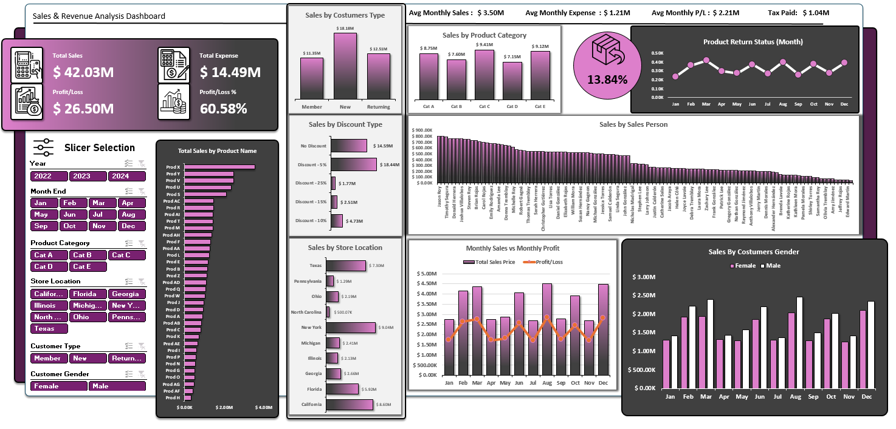

# 📊 Sales & Revenue Analysis Dashboard

> An interactive Excel-based business intelligence dashboard for comprehensive sales performance tracking, revenue analysis, and profit monitoring across multiple dimensions.

---

## 📌 Project Overview

This project presents a fully interactive **Sales & Revenue Analysis Dashboard** built entirely in Microsoft Excel. It transforms over **28,000 raw transaction records** into actionable business insights through dynamic charts, pivot-driven calculations, and interactive slicers — enabling stakeholders to explore performance trends across products, regions, salespeople, and customer segments without any external BI tools.

---

## 🗂️ File Structure

The workbook is organized into **3 dedicated sheets**:

| Sheet | Purpose |
|---|---|
| `Data` | Raw transactional dataset (28,384 records × 20 columns) |
| `Calculations` | Intermediate pivot tables and aggregated metrics powering the dashboard |
| `Dashboard` | Final interactive visual dashboard with charts, KPIs, and slicers |

---

### Dashboard  View

---

## 📁 Dataset Overview

**Source Sheet:** `Data`  
**Records:** 28,384 transactions  
**Time Period:** 2022 – 2024  

### Columns

| # | Column | Description |
|---|---|---|
| 1 | `Sales Date` | Date of transaction |
| 2 | `Month End` | Month of the transaction |
| 3 | `Year` | Fiscal year |
| 4 | `Product Category` | Category group (Cat A – E) |
| 5 | `Store Location` | State where sale occurred |
| 6 | `Product Name` | Individual product identifier |
| 7 | `Unit Sold` | Number of units per transaction |
| 8 | `Unit Cost Price` | Cost per unit |
| 9 | `Unit Sale Price` | Selling price per unit |
| 10 | `Total Cost Price` | Total cost (units × cost price) |
| 11 | `Discount %` | Percentage discount applied |
| 12 | `Discount Type` | Type/tier of discount |
| 13 | `Discount Applied` | Monetary discount amount |
| 14 | `Tax Applied` | Tax charged on the transaction |
| 15 | `Total Sales Price` | Final revenue after discounts |
| 16 | `Profit/Loss` | Net profit or loss per transaction |
| 17 | `Customer Type` | Member / New / Returning |
| 18 | `Customer Gender` | Female / Male |
| 19 | `Sales Person` | Assigned sales representative |
| 20 | `Product Returns` | Whether item was returned |

---

## 📈 Dashboard Features

### 🔢 KPI Summary Cards
High-level business metrics displayed prominently at the top:

| Metric | Value |
|---|---|
| **Total Sales** | $42.03M |
| **Total Expenses** | $14.49M |
| **Profit / Loss** | $26.50M |
| **Profit / Loss %** | 60.58% |
| **Avg Monthly Sales** | $3.50M |
| **Avg Monthly Expenses** | $1.21M |
| **Avg Monthly P/L** | $2.21M |
| **Tax Paid** | $1.04M |

---

### 📊 Visual Charts

| Chart | Insight |
|---|---|
| **Sales by Customer Type** | Compares revenue from Members, New, and Returning customers |
| **Sales by Product Category** | Revenue breakdown across 5 product categories (Cat A–E) |
| **Sales by Discount Type** | Impact of discount tiers (No Discount, -5%, -7.5%, -15%, -10%) on revenue |
| **Sales by Store Location** | Geographic performance across 10 US states |
| **Total Sales by Product Name** | Ranked bar chart for individual product performance |
| **Sales by Sales Person** | Individual rep performance comparison |
| **Monthly Sales vs Monthly Profit** | Dual-axis trend line showing revenue and P/L side by side |
| **Sales by Customer Gender** | Monthly gender-split revenue comparison |
| **Product Return Status (Monthly)** | Monthly product return rate trend line — overall rate: **13.84%** |

---

### 🎛️ Interactive Slicers

The dashboard includes **6 dynamic slicers** that filter all charts simultaneously:

- 📅 **Year** — 2022, 2023, 2024
- 📆 **Month End** — Jan through Dec
- 📦 **Product Category** — Cat A, B, C, D, E
- 📍 **Store Location** — California, Florida, Georgia, Illinois, Michigan, New York, North Carolina, Ohio, Pennsylvania, Texas
- 👤 **Customer Type** — Member, New, Returning
- ⚧ **Customer Gender** — Female, Male

---

## 🛠️ Technical Implementation

- **Platform:** Microsoft Excel (`.xlsx`)
- **Data Processing:** PivotTables used in the `Calculations` sheet to aggregate all metrics
- **Visualization:** Native Excel charts (bar, line, clustered column) linked to pivot data
- **Interactivity:** Excel Slicers connected to all PivotTables for cross-filtering
- **Formatting:** Custom number formatting, conditional styling, and a dark purple/pink theme for visual clarity

---

## 🚀 How to Use

1. **Open** `Revenue___Sales_Analysis_Dashboard.xlsx` in Microsoft Excel (2016 or later recommended)
2. Navigate to the **`Dashboard`** sheet
3. Use the **Slicer Selection panel** on the left to filter by Year, Month, Category, Location, Customer Type, or Gender
4. All charts and KPI cards will **update automatically** based on your selection
5. To explore raw data, navigate to the **`Data`** sheet
6. To inspect calculation logic, visit the **`Calculations`** sheet

> ⚠️ **Note:** Slicer functionality requires Excel desktop. Some features may be limited in Excel Online or Google Sheets.

`Below you can download the Excel file so you can access it locally and use all the options the dashboard has.`

[**Download**](https://github.com/ermirhaxhia/Revenue-Sales-Analysis-Dashboard/raw/main/Revenue%20%26%20Sales%20Analysis%20Dashboard.xlsx)

---

## 📋 Requirements

- Microsoft Excel 2016 or later (Windows / macOS)
- Macros: **Not required**
- External dependencies: **None**

---

## 👤 Author

**Ermir Haxhia** — Applied Mathematics · Data Analysis · Programming  
🌐 [Portfolio](https://ermir-haxhia.vercel.app) · [LinkedIn](https://www.linkedin.com/in/ermir-haxhia-b988212b5) · [GitHub](https://github.com/ermirhaxhia)